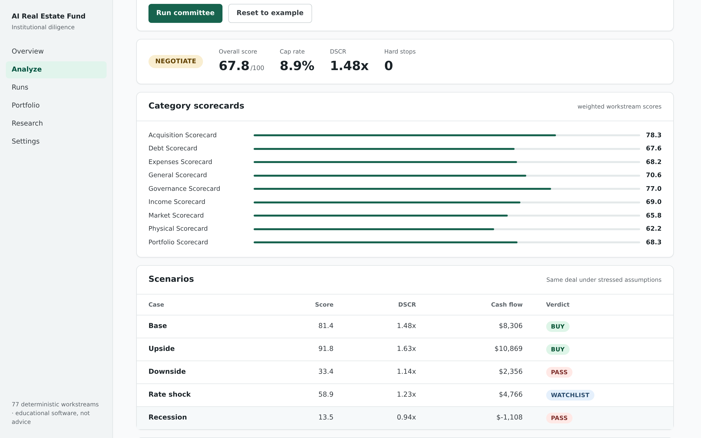
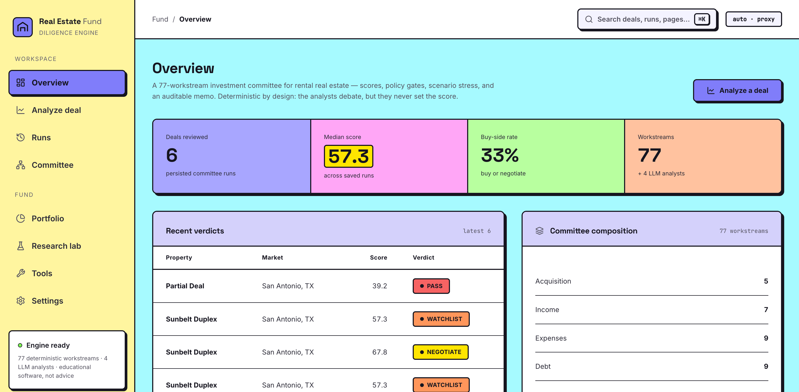
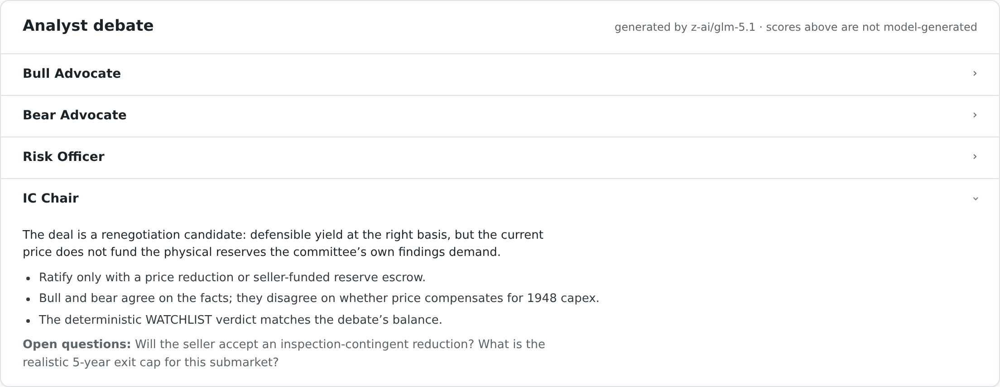
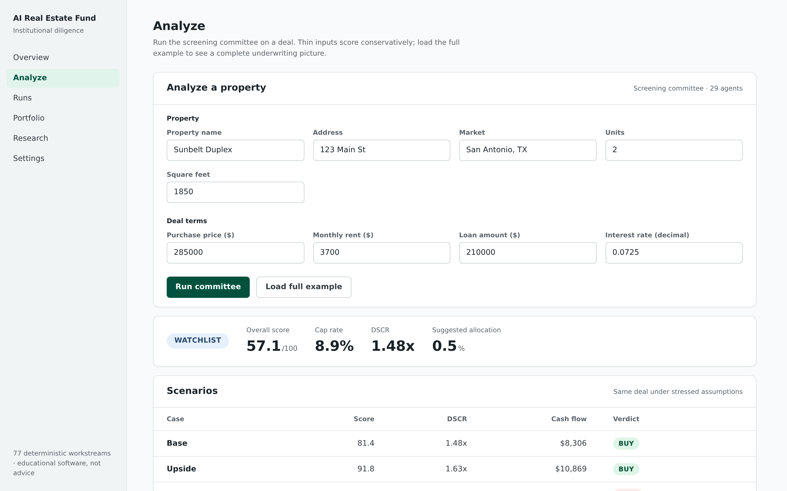
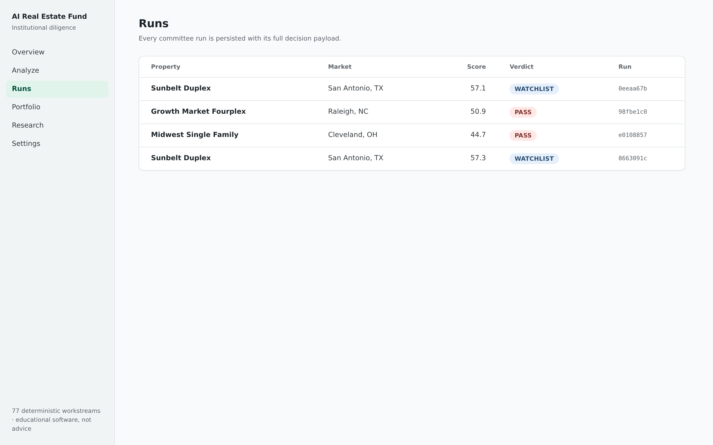

# AI Real Estate Fund

[](https://www.python.org/)
[](LICENSE)
[](app/backend)
[](app/frontend)

A deterministic, auditable real estate diligence engine. It models the way an institutional investment committee evaluates a rental-property deal: 77 specialist diligence workstreams score the deal across acquisition, income, expenses, debt, physical condition, market, legal, governance, and portfolio fit, then the system reconciles assumptions, applies policy gates, builds a risk register, and produces a markdown investment memo with evidence behind every score.

Inspired by [virattt/ai-hedge-fund](https://github.com/virattt/ai-hedge-fund), with a hybrid design: **the scoring is deterministic, the debate is LLM-driven.** Every score comes from explicit, inspectable rules over underwriting math — identical inputs always produce identical scores, and the core runs offline with no API keys. On top of that, four LLM analyst personas (Bull Advocate, Bear Advocate, Risk Officer, IC Chair) debate the committee's structured findings and attach their commentary to the memo. The models argue about the deal; they never grade it.

> **Important:** This is decision-support software for learning and research. It is not financial, legal, tax, lending, valuation, or investment advice. Real-world use requires licensed data, professional review, and human investment approval.



<details>
<summary>More screenshots: overview, scenario stress table, and saved runs</summary>









</details>

---

## What it does

**Underwriting.** NOI, cap rate, cash-on-cash, DSCR, debt yield, IRR, equity multiple, break-even occupancy, loan-to-cost, exit proceeds, DCF and cap-rate valuation, renovation budgeting.

**Grounded methodology.** 60 of the 77 workstreams cite the published standard or reference text (chapter-level) their review is grounded in — Fannie Mae Form 4660 DSCR/LTV floors, Freddie Mac reserve requirements, HUD MAP sizing, USPAP, ASTM E1527, IRS Pub 527, Census/BLS data — via a `sources` field on each spec, deduplicated into a "Methodology Sources" appendix in every memo. See [docs/sources.md](docs/sources.md).

**Institutional committee.** One scoring engine, 77 configured workstreams. Each workstream is declared as data (name, category, weight, focus metrics, report language) in [`specs.py`](src/ai_real_estate_fund/institutional/agents/specs.py) — adding a workstream is a ~10-line config entry, not a new class. The committee output includes category scorecards, hard stops, policy-gate results, a capital stack, a five-year operating plan, a risk register, an allocation plan, committee minutes, and the memo.

**LLM analyst debate.** With `--llm`, four analyst personas reason over the committee's fact pack (metrics, scorecards, policy gates, scenario table, strongest/weakest workstreams). Four providers are supported: [NVIDIA's hosted catalog](https://build.nvidia.com) (default — `z-ai/glm-5.1`, `moonshotai/kimi-k2.6`, `deepseek-ai/deepseek-v4-flash`, and ~120 others), **OpenAI**, **Anthropic (Claude)**, and **Google Gemini**, plus any OpenAI-compatible server via `LLM_BASE_URL`. Analysts run sequentially so the IC Chair reacts to the bull, bear, and risk views, and every claim is grounded in the supplied numbers. Deterministic scores are never modified.

**Screening committee.** A faster 29-agent committee used for ranking many deals and for backtesting.

**Scenarios and sensitivity.** Base/upside/downside/rate-shock/recession scenarios, plus a one-command sensitivity table over rent, vacancy, and rate assumptions.

**Backtesting.** A historical-deal simulation framework that replays the screening committee over deal panels.

**Service layer.** FastAPI backend with scoped API-key auth, rate limiting, request-size limits, security headers, an append-only SQLite audit log with hash-chain verification, Prometheus-style metrics, and health/readiness endpoints. A small React dashboard covers analysis runs and results.

---

## Quick start

Requires Python 3.10+. Node 20+ and Docker are optional.

```bash
git clone https://github.com/xhu96/ai-real-estate-fund.git
cd ai-real-estate-fund
python -m pip install -e .

# Run the institutional committee on a sample deal
python -m ai_real_estate_fund institutional examples/duplex_sunbelt.json

# Write the memo to a file
python -m ai_real_estate_fund institutional examples/duplex_sunbelt.json --out reports/memo.md

# Add LLM analyst commentary — set any one provider key
export NVIDIA_API_KEY=nvapi-...        # free key from https://build.nvidia.com (default provider)
# or: export OPENAI_API_KEY=... / ANTHROPIC_API_KEY=... / GEMINI_API_KEY=...
python -m ai_real_estate_fund institutional examples/duplex_sunbelt.json --llm
python -m ai_real_estate_fund institutional examples/duplex_sunbelt.json --llm --llm-provider anthropic
python -m ai_real_estate_fund institutional examples/duplex_sunbelt.json --llm --llm-provider gemini --llm-model gemini-2.5-pro
```

See [docs/sample_memo.md](docs/sample_memo.md) for a full memo including the four-analyst debate.

Other CLI commands:

```bash
python -m ai_real_estate_fund committee examples/duplex_sunbelt.json     # fast screening committee
python -m ai_real_estate_fund compare examples/properties.csv            # rank multiple deals
python -m ai_real_estate_fund sensitivity examples/duplex_sunbelt.json   # sensitivity table
python -m ai_real_estate_fund readiness --strict                         # production-readiness checks
python -m ai_real_estate_fund audit-verify --db data/audit.db            # verify audit hash chain
python -m ai_real_estate_fund.backtesting.cli --examples examples/properties.csv
```

### API

```bash
python -m pip install -e ".[api]"
uvicorn app.backend.main:create_app --factory --reload
```

| Endpoint | Purpose |
|---|---|
| `POST /institutional/analyze` | Full institutional committee analysis (`?llm=true` adds analyst commentary; `&llm_provider=` selects nvidia/openai/anthropic/gemini) |
| `POST /institutional/memo.md` | Markdown memo export (`?llm=true` adds analyst commentary) |
| `POST /analyses` | Screening committee analysis (persisted) |
| `GET /ops/health` · `GET /ops/ready` | Health and readiness |
| `GET /ops/metrics` | Prometheus-style metrics |
| `GET /ops/audit/verify` | Audit hash-chain verification |

```bash
curl -X POST http://localhost:8000/institutional/analyze \
  -H "Content-Type: application/json" \
  -d @examples/duplex_sunbelt.json
```

### Frontend

```bash
cd app/frontend
npm install
npm run dev   # expects the API on localhost:8000
```

### Docker

```bash
docker compose up --build                                          # local
APP_ENV=production docker compose -f compose.production.yml up     # production-style
```

---

## How a deal flows through the system

```text
property JSON / CSV
      |
      v
underwriting engine  ──  deterministic metrics (NOI, DSCR, IRR, ...)
      |
      v
77 diligence workstreams  ──  one scoring engine, config-driven roster
      |
      v
policy gates · hard stops · risk register · scenarios
      |
      v
capital stack · operating plan · allocation · committee minutes
      |
      v
investment memo (markdown / JSON)  +  audit log entry
```

Data comes from fixture providers by default so everything runs offline; the provider interfaces are designed to be swapped for licensed sources.

---

## Testing

```bash
python -m unittest discover -s tests       # 50 tests
python scripts/smoke_test.py               # end-to-end committee run
APP_ENV=ci python -m ai_real_estate_fund readiness --strict
```

CI runs the suite on Python 3.10–3.12, plus a Docker build, on every push.

---

## Repository structure

```text
├── src/ai_real_estate_fund/
│   ├── finance.py               # deterministic underwriting math
│   ├── llm.py                   # OpenAI-compatible client (NVIDIA catalog default)
│   ├── institutional/           # 77-workstream committee, policy gates, memo
│   │   ├── analysts.py          # LLM analyst personas (bull/bear/risk/chair)
│   │   └── agents/              # base engine + specs.py (the roster, as data)
│   ├── investment_committee/    # 29-agent screening committee
│   ├── backtesting/             # historical-deal simulation
│   ├── portfolio/ risk/ valuation/ validation/
│   └── production/              # auth, audit log, readiness, observability
├── app/backend/                 # FastAPI service
├── app/frontend/                # React/Vite dashboard
├── tests/                       # unit + API tests
├── examples/                    # sample deals, comps, market snapshots
├── docs/                        # architecture, API, runbooks, ADRs
└── scripts/                     # smoke test, preflight, backup/restore
```

---

## Design notes

**Why split scoring from debate?** Underwriting decisions need to be defended in front of a committee, so the numbers come from a rules engine: bit-identical reruns, line-by-line explainability, tests that pin behavior. LLMs are good at the part rules are bad at — arguing about what the numbers mean, surfacing fragile assumptions, drafting the questions a sponsor must answer. Keeping the two layers separate means a model hallucination can never change a score, and the whole system still works (and tests) offline. See [docs/model_risk.md](docs/model_risk.md).

**What "agent" means here.** Each of the 77 workstreams is an isolated scoring unit with its own weight, focus metrics, evidence, and follow-up actions. The four LLM analysts are the generative layer on top — closer to ai-hedge-fund's named analysts, but constrained to the committee's fact pack.

**Production boundary.** The production layer (auth, audit, rate limiting, readiness gates) demonstrates operational patterns and is tested at the unit/API level, but this project has not been operated as a real service. Treat it as a reference implementation.

## License

MIT — see [LICENSE](LICENSE).
