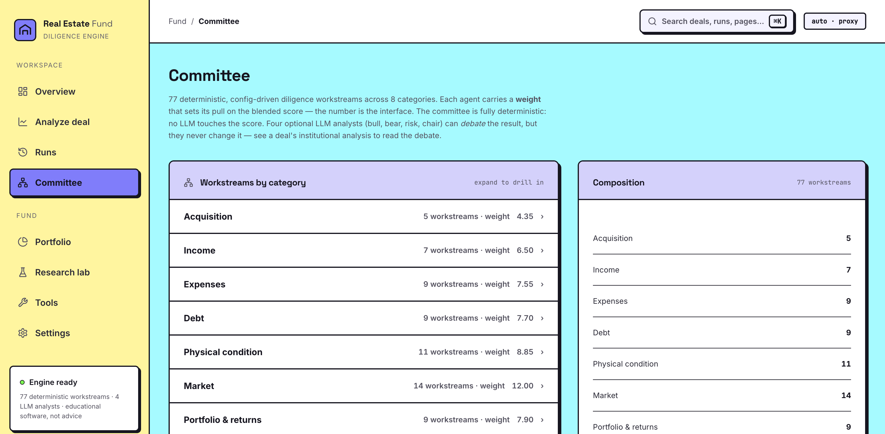

# AI Real Estate Fund

[](https://www.python.org/)
[](LICENSE)
[](app/backend)
[](app/frontend)

A deterministic, auditable real estate diligence engine. It models the way an institutional investment committee evaluates a rental-property deal: 77 specialist diligence workstreams score the deal across acquisition, income, expenses, debt, physical condition, market, legal, governance, and portfolio fit, then the system reconciles assumptions, applies policy gates, builds a risk register, and produces an investment memo (Markdown or PDF) with evidence behind every score.

Inspired by [virattt/ai-hedge-fund](https://github.com/virattt/ai-hedge-fund), with a hybrid design: **the scoring is deterministic, the debate is LLM-driven.** Every score comes from explicit, inspectable rules over underwriting math — identical inputs always produce identical scores, and the core runs offline with no API keys. On top of that, four LLM analyst personas (Bull Advocate, Bear Advocate, Risk Officer, IC Chair) debate the committee's structured findings and attach their commentary to the memo. The models argue about the deal; they never grade it.

> **Important:** This is decision-support software for learning and research. It is not financial, legal, tax, lending, valuation, or investment advice. Real-world use requires licensed data, professional review, and human investment approval.


<details>
<summary>More screenshots: overview, the committee roster, scenario stress, and saved runs</summary>





</details>

---

## What it does

**Underwriting.** NOI, cap rate, cash-on-cash, DSCR, debt yield, IRR, equity multiple, break-even occupancy, loan-to-cost, exit proceeds, DCF and cap-rate valuation, renovation budgeting.

**Grounded methodology.** 60 of the 77 workstreams cite the published standard or reference text (chapter-level) their review is grounded in — Fannie Mae Form 4660 DSCR/LTV floors, Freddie Mac reserve requirements, HUD MAP sizing, USPAP, ASTM E1527, IRS Pub 527, Census/BLS data — via a `sources` field on each spec, deduplicated into a "Methodology Sources" appendix in every memo. See [docs/sources.md](docs/sources.md).

**Institutional committee.** One scoring engine, 77 configured workstreams. Each workstream is declared as data (name, category, weight, focus metrics, report language) in [`specs.py`](src/ai_real_estate_fund/institutional/agents/specs.py) — adding a workstream is a ~10-line config entry, not a new class. The same config-driven pattern now backs the asset-management, research-signal, underwriting-model, integration-adapter, and model-validation families (each a `base.py` + `specs.py` registry rather than dozens of near-identical files). The committee output includes category scorecards, hard stops, policy-gate results, a capital stack, a five-year operating plan, a risk register, an allocation plan, committee minutes, and the memo.

**LLM analyst debate.** With `--llm`, four analyst personas reason over the committee's fact pack (metrics, scorecards, policy gates, scenario table, strongest/weakest workstreams). Four providers are supported: [NVIDIA's hosted catalog](https://build.nvidia.com) (default; ~120 models including `meta/llama-3.1-8b-instruct` and `meta/llama-3.3-70b-instruct`), **OpenAI**, **Anthropic (Claude)**, and **Google Gemini**, plus any OpenAI-compatible server via `LLM_BASE_URL`. Analysts run sequentially so the IC Chair reacts to the bull, bear, and risk views, and every claim is grounded in the supplied numbers. Deterministic scores are never modified. (Hosted models cold-start on first call; a fast small model is the default, larger models trade a slower first call for stronger analysis.)

**Screening committee.** A faster 29-agent committee used for ranking many deals and for backtesting.

**Scenarios and sensitivity.** Base/upside/downside/rate-shock/recession scenarios, plus a one-command sensitivity table over rent, vacancy, and rate assumptions.

**Backtesting.** A historical-deal simulation framework that replays the screening committee over deal panels.

**Service layer.** FastAPI backend with scoped API-key auth (fail-closed in deployed environments), request validation, rate limiting, request-size limits, security headers, structured logging, an append-only SQLite audit log with hash-chain verification, Prometheus-style metrics, and health/readiness endpoints. It can also serve the built dashboard same-origin, so one process hosts the whole app.

**Dashboard.** A React/Vite single-page app covering the full workflow: analyze a deal, browse and deep-link into saved runs, inspect the 77-workstream committee roster, optimize a portfolio across runs, backtest, and run standalone tools (market comps, model-calibration/drift). Plus a ⌘K command palette, JSON import, CSV/JSON/PDF export, and a missing-data-friendly form (only name, address, market, and price are required). See [PRODUCT.md](PRODUCT.md) for the design system.

---

## Quick start

Requires Python 3.10+. Node 20+ and Docker are optional.

```bash
git clone https://github.com/xhu96/ai-real-estate-fund.git
cd ai-real-estate-fund
python -m pip install -e .

# Run the institutional committee on a sample deal
python -m ai_real_estate_fund institutional examples/duplex_sunbelt.json

# Write the memo to a file
python -m ai_real_estate_fund institutional examples/duplex_sunbelt.json --out reports/memo.md

# Add LLM analyst commentary — set any one provider key
export NVIDIA_API_KEY=nvapi-...        # free key from https://build.nvidia.com (default provider)
# or: export OPENAI_API_KEY=... / ANTHROPIC_API_KEY=... / GEMINI_API_KEY=...
python -m ai_real_estate_fund institutional examples/duplex_sunbelt.json --llm
python -m ai_real_estate_fund institutional examples/duplex_sunbelt.json --llm --llm-provider anthropic
python -m ai_real_estate_fund institutional examples/duplex_sunbelt.json --llm --llm-provider gemini --llm-model gemini-2.5-pro
```

See [docs/sample_memo.md](docs/sample_memo.md) for a full memo including the four-analyst debate.

Other CLI commands:

```bash
python -m ai_real_estate_fund committee examples/duplex_sunbelt.json     # fast screening committee
python -m ai_real_estate_fund compare examples/properties.csv            # rank multiple deals
python -m ai_real_estate_fund sensitivity examples/duplex_sunbelt.json   # sensitivity table
python -m ai_real_estate_fund readiness --strict                         # production-readiness checks
python -m ai_real_estate_fund audit-verify --db data/audit.db            # verify audit hash chain
python -m ai_real_estate_fund.backtesting.cli --examples examples/properties.csv
```

## Run the app (UI + API)

Two ways to run the dashboard, **neither needs a copied URL** — the frontend auto-connects (the dev server proxies API calls; the production server hosts the SPA same-origin):

```bash
./dev.sh        # dev: API on :8000 + Vite (live reload) on :5173, then open http://localhost:5173
./app/run.sh    # single server: builds the SPA and serves it + the API, then open http://localhost:8000
```

`./dev.sh` is best while editing the UI. `./app/run.sh` is a one-process "just run it" for a demo or review (configurable `PORT`/`HOST`). To point at a non-default backend in dev, set `VITE_PROXY_TARGET=http://host:port`. A manual override (Settings → API base URL) is preserved for remote backends.

### API

```bash
python -m pip install -e ".[api]"
uvicorn app.backend.main:create_app --factory --reload
```

| Endpoint | Purpose |
|---|---|
| `POST /institutional/analyze` | Full institutional committee (`?llm=true` adds analyst commentary; `&llm_provider=` selects nvidia/openai/anthropic/gemini) |
| `POST /institutional/memo.md` · `POST /exports/memo.md` | Markdown memo export (institutional / screening) |
| `POST /institutional/report.pdf` · `POST /exports/report.pdf` | PDF report export |
| `POST /analyses` · `GET /analyses` · `GET /analyses/{run_id}` | Run a screening analysis (persisted), list runs, fetch one |
| `GET /committee/roster` | The 77 workstreams grouped by category, with weights and citations |
| `POST /portfolio/optimize` · `POST /portfolio/optimize-runs` | Portfolio allocation across candidates or saved runs |
| `POST /research/backtest` | Backtest the committee over the bundled deal panel |
| `GET /comps/{market}` · `POST /validation/calibration` · `POST /validation/drift` | Market comps; model calibration and drift (PSI) |
| `GET /ops/health` · `GET /ops/ready` · `GET /ops/metrics` · `GET /ops/audit/verify` | Health, readiness, Prometheus metrics, audit hash-chain verification |

Auth is open in local/demo mode and fails closed in `staging`/`production` (set `REQUIRE_API_KEY=true` with `API_KEY_HASHES`). Interactive docs are at `/docs` in demo mode.

```bash
curl -X POST http://localhost:8000/institutional/analyze \
  -H "Content-Type: application/json" \
  -d @examples/duplex_sunbelt.json
```

### Docker

```bash
docker compose up --build                                          # local
APP_ENV=production docker compose -f compose.production.yml up     # production-style
```

---

## How a deal flows through the system

```text
property JSON / CSV
      |
      v
underwriting engine  ──  deterministic metrics (NOI, DSCR, IRR, ...)
      |
      v
77 diligence workstreams  ──  one scoring engine, config-driven roster
      |
      v
policy gates · hard stops · risk register · scenarios
      |
      v
capital stack · operating plan · allocation · committee minutes
      |
      v
investment memo (Markdown / JSON / PDF)  +  audit log entry
```

Data comes from fixture providers by default so everything runs offline; the provider interfaces are designed to be swapped for licensed sources.

---

## Testing

```bash
python -m pytest -q                        # full suite (unit + API)
python scripts/smoke_test.py               # end-to-end committee run
APP_ENV=ci python -m ai_real_estate_fund readiness --strict
cd app/frontend && npm run build           # type-check + bundle the UI
```

The suite includes golden-master tests that pin the consolidated families to byte-identical behavior. CI runs the suite on Python 3.10–3.12, plus a Docker build, on every push.

---

## Repository structure

```text
├── src/ai_real_estate_fund/
│   ├── finance.py               # deterministic underwriting math
│   ├── llm.py                   # OpenAI-compatible client (NVIDIA catalog default)
│   ├── report_pdf.py            # PDF report renderer (fpdf2)
│   ├── institutional/           # 77-workstream committee, policy gates, memo
│   │   ├── analysts.py          # LLM analyst personas (bull/bear/risk/chair)
│   │   ├── agents/              # base engine + specs.py (the roster, as data)
│   │   └── {asset_management,research,underwriting,integrations,model_validation}/  # base.py + specs.py registries
│   ├── investment_committee/    # 29-agent screening committee
│   ├── backtesting/             # historical-deal simulation
│   ├── portfolio/ risk/ valuation/ validation/
│   └── production/              # auth, audit log, readiness, observability
├── app/backend/                 # FastAPI service (can also serve the built UI)
├── app/frontend/                # React/Vite dashboard (HashRouter, neobrutalist theme)
├── tests/                       # unit + API + golden-master tests
├── examples/                    # sample deals, comps, market snapshots
├── docs/                        # architecture, API, runbooks, ADRs
└── scripts/                     # smoke test, preflight, backup/restore
```

---

## Design notes

**Why split scoring from debate?** Underwriting decisions need to be defended in front of a committee, so the numbers come from a rules engine: bit-identical reruns, line-by-line explainability, tests that pin behavior. LLMs are good at the part rules are bad at — arguing about what the numbers mean, surfacing fragile assumptions, drafting the questions a sponsor must answer. Keeping the two layers separate means a model hallucination can never change a score, and the whole system still works (and tests) offline. See [docs/model_risk.md](docs/model_risk.md).

**What "agent" means here.** Each of the 77 workstreams is an isolated scoring unit with its own weight, focus metrics, evidence, and follow-up actions. The four LLM analysts are the generative layer on top — closer to ai-hedge-fund's named analysts, but constrained to the committee's fact pack.

**The supporting families are illustrative.** The asset-management monitors, research signals, underwriting models, integration adapters, and model-validation checks demonstrate the shape of a production fund system. They are uncalibrated deterministic heuristics, not validated models, and are not wired into the committee score; each family is consolidated into a small config-driven registry.

**Production boundary.** The production layer (auth, audit, rate limiting, readiness gates) demonstrates operational patterns and is tested at the unit/API level, but this project has not been operated as a real service. Treat it as a reference implementation.

## License

Free for **noncommercial use** under the [PolyForm Noncommercial License 1.0.0](LICENSE) (research, personal study, hobby projects, education, nonprofits, and government). PolyForm Noncommercial is a source-available license, not an OSI-approved open-source license.

**Commercial use requires a separate commercial license.** To request one, open a **[Commercial license request](https://github.com/xhu96/ai-real-estate-fund/issues/new?template=commercial-license.yml)** issue — leave your company and contact email, and the author will follow up. It's a dedicated request form (labeled `commercial-license`), not a bug report.

Versions released before this license change remain under their original MIT terms.
